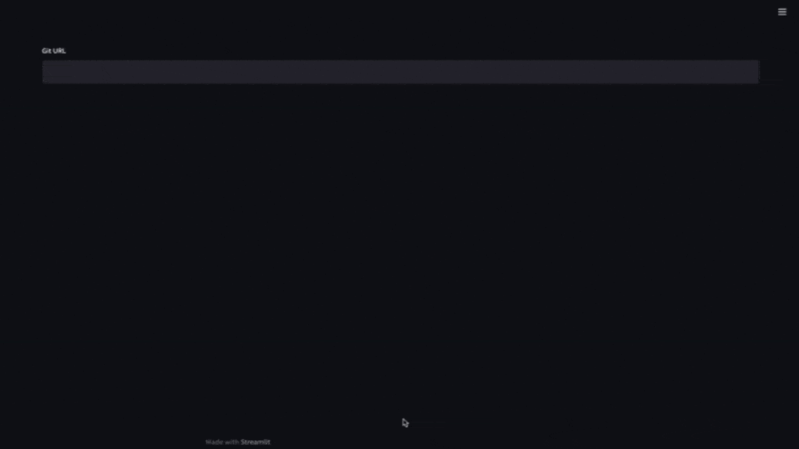
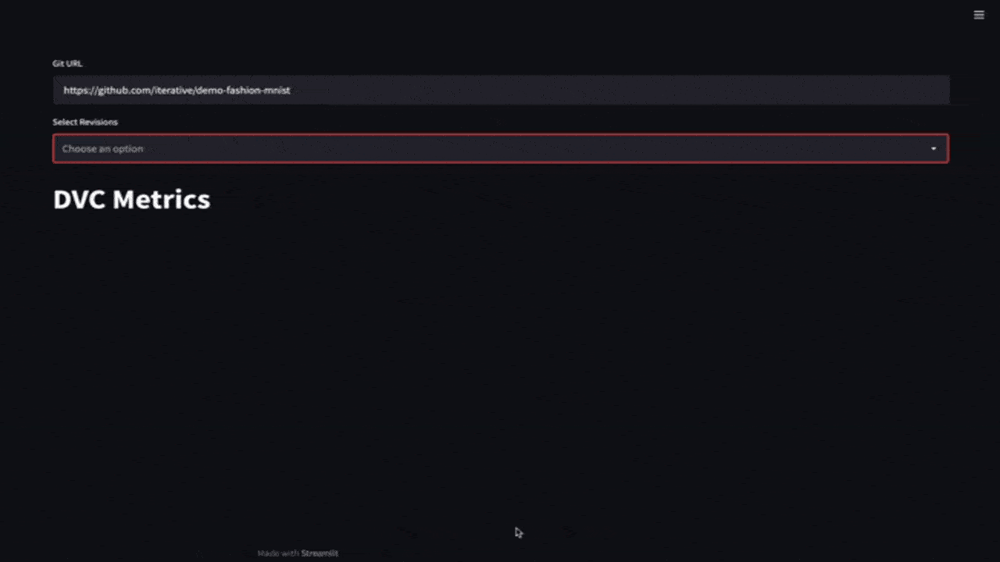
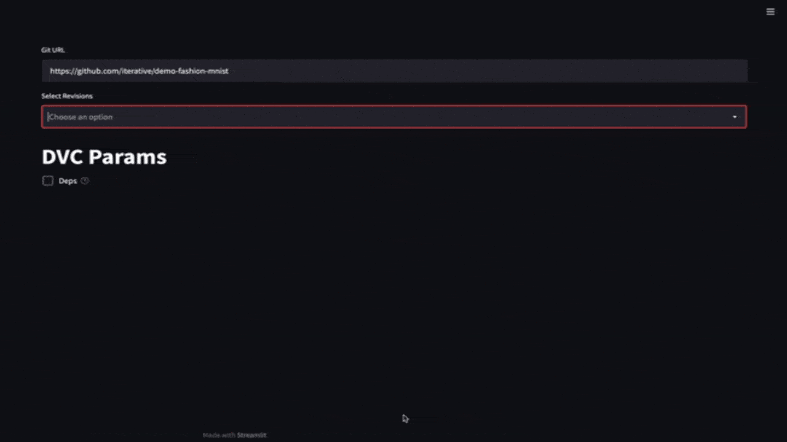
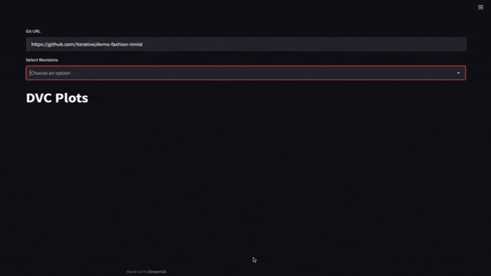

# dvc-streamlit-components

Streamlit components for DVC 

Try online demo https://share.streamlit.io/daavoo/dvc-streamlit-components/main/example/example_app.py

Or run locally:

```
git clone git@github.com:iterative/dvc-streamlit-components.git
cd dvc-streamlit-components
pip install -r requirements.txt
streamlit run example/example_app.py
```

## - `dvc_streamlit.dvc_repo`

Gets a `dvc.api.Repo` instance from URL

## - `dvc_streamlit.rev_selector`

Multi select revisions from a `dvc.api.Repo`.



## - `dvc_streamlit.dvc_metrics`

Show/Compare [DVC metrics](https://dvc.org/doc/command-reference/metrics) from different revisions.



## - `dvc_streamlit.dvc_params`

Show/Compare [DVC params](https://dvc.org/doc/command-reference/params) from different revisions.



## - `dvc_streamlit.plots`

Show/Compare [DVC plots](https://dvc.org/doc/command-reference/plots) from different revisions.


